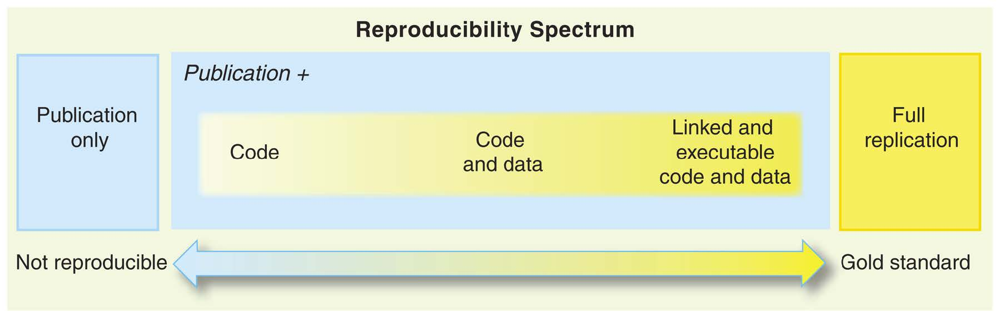

# Introduction {#intro}

@claerbout1992electronic:

> An article about computational results is advertising, not scholarship. The
> actual scholarship is the full software environment, code and data, that
> produced the result.

## Why Reproducibility?

Reproducibility is defined as the ability to recompute data analytic results,
given an observed data set and knowledge of the data analysis pipeline
[@peng2015reproducibility]. There are two basic reasons to be concerned about
making your research reproducible [@ropensci2018reproducibility]:

1. to show evidence of the correctness of your results, and
2. to enable others to make use of your methods and results

As building energy simulation (BES) becomes more integral to many aspects of
architecture design and decision-making processes, computational reproducibility
has become increasingly important to researchers, designers and practitioners.
Lack of credibility in BES results due to a lack of reproducibility is widely
considered a problem by the energy modeling community [@jia2021eplusr].

## Reproducibility Spectrum

@peng2011reproducible gave a reproducibility spectrum and summarized two major
components to successful reproducible research:

1. data, i.e. the availability of raw data from the experiment, and
2. code, i.e. the availability of the statistical code and documentation to
   reproduce the results.

```{r spectrum, echo = FALSE, fig.align = "center", fig.cap = "The spectrum of reproducibility [@peng2011reproducible]"}

```

However, the complex and rapidly changing nature of computer environments makes
it immensely challenging to reproduce the same workflow and results even with
the original data and code are available.

Taken together, these are three key components for a reproducible BES:

1. building energy models, weather data and other raw data dependencies,
2. code to perform simulations and following data-driven analytics,
3. portable and reusable computational environment encapsulating essential
   software and applications

## Research compendium

@marwick2018packaging gave a difination:

> The goal of a research compendium is to provide a standard and easily
> recognisable way for organising the digital materials of a project to enable
> others to inspect, reproduce, and extend the research.

### Three Principles

* Organize its files according to the prevailing conventions of the scholarly
  community, whether that be an academic discipline or a lab group.

* Maintain a clear separation of data, method, and output, while unambiguously
  expressing the relationship between those three.

* Specify the computational environment that was used for the original analysis.

### R package as a research compendium

* R package structure is uniquely suitable to being easily adapted to solve
  problems of organizing files and sharing them with other researchers.

* Benefit from the quality control mechanisms required to successfully build an
  R package.

```{r dev-pkg, fig.cap = "R Packages for package development", fig.show = "hold", out.width = "10%", echo = FALSE}
knitr::include_graphics(c(
    "images/devtools.png",
    "images/roxygen2.png",
    "images/testthat.png",
    "images/usethis.png"
))
```

### Examples of real-world research compendia

```{r pkg-examples, fig.cap = "File structure of real-world research compedia [@marwick2018packaging]", fig.show = "hold", out.width = "25%", echo = FALSE}
knitr::include_graphics(c(
    "images/r_pkg_small.jpg",
    "images/r_pkg_medium.jpg",
    "images/r_pkg_large1.jpg",
    "images/r_pkg_large2.jpg"
))
```

