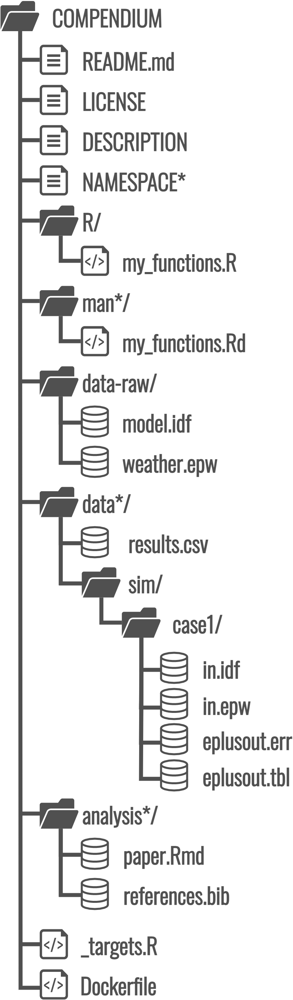
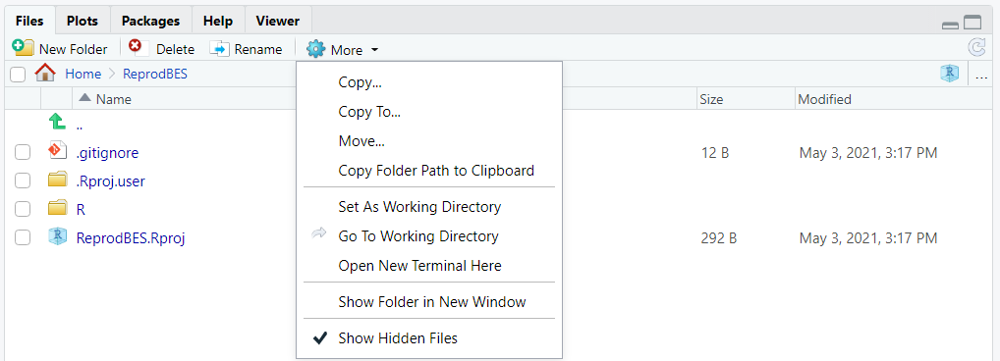
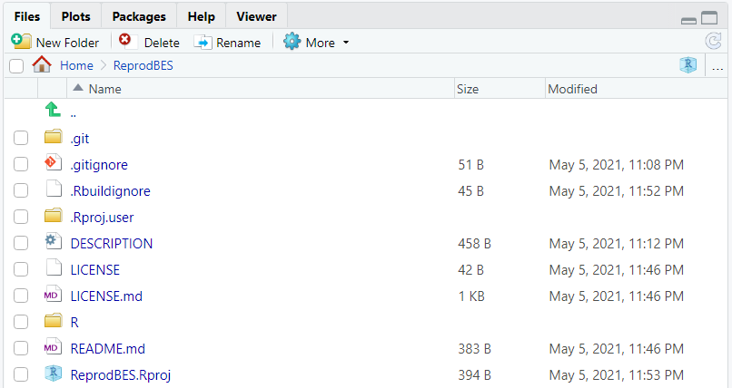
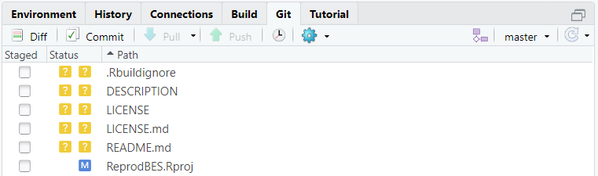
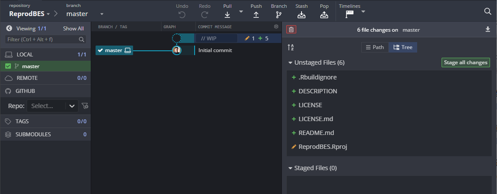

# Build up project {#project}

```{r, include = FALSE}
options(crayon.enabled = FALSE)

## build the package? if so, where?
## * NA     --> no, don't build it
## * "user" --> build in home, so it's easy to access after
## * "tmp"  --> build in session temp dir, it's disposable
where <- "user"
```

This chapter gives a description on what the file structure would look like for
a compendium for building energy simulation research and demonstrate the
necessary steps to build up a file structure of research compendium using
{usethis} [@wickham2021usethis] from stretch. It is based on the {usethis}
[*Setup*](https://usethis.r-lib.org/articles/articles/usethis-setup.html)
vignette and the free online book [Happy Git and GitHub for the useR](https:
//happygitwithr.com/) by @bryan2021happy.

## Prerequisites

This chapter focusses on {usethis}, a workflow package that automates repetitive
tasks that arise during project setup and development, both for R packages and
non-package projects. You can load {usethis} by running this code:

```{r}
library(usethis)
```

## R-package-style file structure

:::: {.columns style="display: flex;"}

::: {.column width="25%"}
```{r pkg-structure, echo = FALSE, out.width = "90%"}

```
:::

::: {.column width="75%"}
- `README.md`: Description of contents and guide to users

- `LICENSE`: Specify conditions of use/reuse of code, data, text and output

- `DESCRIPTION`: Project metadata, including authors, version, license type,
  etc.

- `NAMESPACE`: (Optional) Auto-generated file that exports R functions for
  repeated use. Only needed if the compendium is bundled as an R package and it
  contains exported functions.

- `R/`: custom R functions used repeatedly throughout the project.

- `man`: (Optional) Auto-generated documentation for the custom R functions.
  Only needed if the compendium is bundled as an R package and it contains
  exported functions.

- `data-raw/`: Raw data in open formats, not changed once created. Usually
  contains the model, weather file and other raw data input.

- `data/`: (Optional) Main simulation output for each case and result summary.

- `analysis/`: R Markdown file and BibTeX file. We will focus on this in Chapter
  [Literate programming].

- `_targets.R`: Defines the workflow using [{targets}](https://github.com/ropensci/targets)
  package. We will build it in Chapter [Workflow automation].

- `renv.lock`: The [{renv}](https://rstudio.github.io/renv/) lockfile,
  describing the state of libraries used in this project. It will be created in
  Chapter [Computational environment].

- `Dockerfile`: Docker image specification. Same as above, we will work on it in
  Chapter [Computational environment].
:::

::::

## Setup .Rprofile

`.Rprofile` is a plain text file that contains R code to be run every time R
starts up. Typically `.Rprofile` is located in the users' home directory, i.e.
`~/.Rprofile`.

Example use cases for `.RProfile` include: wrting a welcome message, setting a
default CRAN mirror for quicker package downloading, changing global options, etc.

We can use `.Rprofile` to add some {usethis} options about the metadata of
package creation.  These options will be used every time you create a new R
project using {usethis}.

The easiest way to edit `.Rprofile` is by running `usethis::edit_r_profile()`.
Open it add add codes below to it. Do remember to change values like name, email,
etc. accordingly.

```{r usethis-profile}
options(
    # default author name. change accordingly
    usethis.full_name = "Hongyuan Jia",
    # default values in the DESCRIPTION file. change accordingly
    usethis.description = list(
        "Authors@R" = utils::person(
            # default author name
            "Hongyuan", "Jia",
            # default author email
            email = "hongyuanjia@outlook.com",
            # default role, i.e. aut = author, cre = creator
            role = c("aut", "cre"),
            # default ORCID
            comment = c(ORCID = "0000-0002-0075-8183")
            ),
        # default license of the R code
        License = "MIT + file LICENSE",
        # default package initial version
        Version = "0.0.0.9000"
    )
)
```

## Create an R project

```{r configure, include = FALSE}
where <- match.arg(
    as.character(where),
    choices = c(NA, "user", "tmp")
)
create <- !is.na(where)
where <- switch(
    where,
    user = fs::path_home(),
    tmp = fs::path_temp(),
    NULL
)

projpath <- fs::path(where, "ReprodBES")

if (!is.null(where)) {
    if (fs::dir_exists(projpath)) fs::dir_delete(projpath)
    fs::dir_create(projpath)
}

wd <- getwd()
```

`usethis::create_project()` will create a barebone project structure. A new
RStudio session will automatically open with active project setting to the
`ReprodBES` we just created.

```{r create-project-fake, eval = FALSE}
create_project("~/ReprodBES", rstudio = true)
```

```{r create-project, eval = create, echo = FALSE}
create_project(projpath, rstudio = TRUE, open = FALSE)
```

Remember to toggle the **`Show Hidden Files`** option in the `Files` pane to see
all files, including hidden ones.

In Fig. \@ref(fig:init-proj), except the `R` folder which you may have already
known the usage of it in [R-package-style file structure], the other three are:

- `ReprodBES.Rproj`: the RStudio project file which contains project-specific
  RStudio settings:
```{r}
readLines(with_project(projpath, proj_path("ReprodBES.Rproj"), quiet = TRUE))
```

- `.Rproj.user/`: a directory to store project-specific temporary files for
  RStudio (e.g. auto-saved source documents, window-state, etc.)

- `.gitignore`: A plain text file specifying intentionally untracked files to
  ignore under version control using Git.  You can see {usethis} has already add
  the `.Rproj.user` folder in it to ignore all files in that folder.

```{r init-proj, echo = FALSE, fig.cap = "Contents in the initialized project folder"}

```

## Setup Git

[Git](http://git-scm.com/) is a **version control system**. Git manages the
evolution of a set of files – called a **repository** – in a sane, highly
structured way. Git has been re-purposed by the data science community. It has
been used to manage the motley collection of files that make up typical data
analytical projects, which often consist of data, figures, reports, and source
code. For a more thorough introduction on Git, I highly recommend the free
online book [Happy Git and GitHub for the useR](https: //happygitwithr.com/) by
@bryan2021happy. At current stage, we will focus on Git. The integration with
GitHub will be described in Chapter [Sharing the compendium].

After Git installation, you can set your Git user name and email using
`usethis::use_git_config()` by running:

```{r git-config}
use_git_config(user.name = "Hongyuan Jia", user.email = "hongyuanjia@outlook.com")
```

For the email address, it is recommended to set it as the same one associated
with your GitHub account.

Next, we will use `usethis::use_git()` to initialize the project as a Git
repository. A interactive prompt will pop up to let you chose whether to commit.
Select yes.

```{r init-git-fake, eval = FALSE}
use_git()
#> √ Setting active project to '~/ReprodBES'
#> √ Initialising Git repo
#> √ Adding '.Rhistory', '.Rdata', '.httr-oauth', '.DS_Store' to '.gitignore'
#> There are 2 uncommitted files:
#> * '.gitignore'
#> * 'ReprodBES.Rproj'
#> Is it ok to commit them?
#>
#> 1: Negative
#> 2: No
#> 3: For sure
#>
#> Selection:
```

```{r init-git, eval = create, include = FALSE}
with_project(projpath, use_git(), quiet = TRUE)

# mimick the git commit process usethis::use_git() does in an interactive
# session
with_project(projpath, quiet = TRUE, {
    stat <- gert::git_status()
    paths <- stat[stat$status == "new", "file", drop = TRUE]
    gert::git_add(paths)
    gert::git_commit("Initial commit")
})
```

## Create `DESCRIPTION`

The job of the DESCRIPTION file is to store important metadata about your
project. When sharing your project with others, this metadata becomes
increasingly important because it specifies who can use it (the license) and
whom to contact if there are any problems.

Most importantly, `DESCRIPTION` is a defining feature of an R package. R
cosiders any directory containing `DESCRIPTION` to be a package and enables you
to use a rich set of tools to ease the project development process.

Every package must have a DESCRIPTION. In fact, it’s the defining feature of a
package (RStudio and devtools consider any directory containing DESCRIPTION to
be a package). To get you started, usethis::create_package("mypackage")
automatically adds a bare-bones description file. This will allow you to start
writing the package without having to worry about the metadata until you need
to. The minimal description will vary a bit depending on your settings, but
should look something like this:

`usethis::use_description()` will create an `DESCRIPTION`. Fields like `Author`,
`License` will be automatically filled based on the `.Rprofile` settings.
You can update the `Title` and `Description` fields if you want. For this
example, I will just use the default values.

```{r init-desc-fake, eval = FALSE}
use_description()
```

```{r init-desc, eval = create, echo = FALSE}
with_project(projpath, use_description(), quiet = TRUE)
```

## Create `LICENSE`

In [Create Description], the `License` has been filled with the one we set using
{usethis} options. Normally this license defines how others can use our
**code**. For a description on common open source software licenses, you can
read [R Packages](https://r-pkgs.org/description.html#description-license) book.

In this guide, we will use this MIT license, a simple and permissive license
that lets everyone use and freely distribute the code with one one restriction:
the license must always be distributed with the code. We can create a simple
license file using `usethis::use_mit_license()` together with your name:

```{r init-license-fake, eval = FALSE}
use_mit_license("Hongyuan Jia")
```

```{r init-license, eval = create, echo = FALSE}
with_project(projpath, use_mit_license("Hongyuan Jia"), quiet = TRUE)
```

## Create `README.md`

The `README.md` provides description of contents and guide to users to your
project. On GitHub, the `README.md` will be rendered as HTML and displayed on
the repository home page.

We can create a simple `README.md` using `usethis::use_readme_md()` helper:

```{r init-readme-fake, eval = FALSE}
use_readme_md()
```

```{r init-readme, eval = create, echo = FALSE}
with_project(projpath, use_readme_md(), quiet = TRUE)
```

We will add details about description, citation, license and etc in Chapter
[Sharing the compendium]. We can leave the `README.md` as it for now.

## Overview of current files

After the above steps, the file structure of our project looks like this (Fig.
\@ref(fig:pkg-files)):

```{r pkg-files, echo = FALSE, fig.cap = "Overview of project file structure"}

```

Your RStudio `Git` pane will look like Fig. \@ref(fig:git-pane).

```{r git-pane, echo = FALSE, fig.cap = "RStudio `Git` pane"}

```

If you are using GitKraken, the workspace will look similar like Fig.
\@ref(fig:gitkraken).

```{r gitkraken, echo = FALSE, fig.cap = "GitKraken workspace overview"}

```

