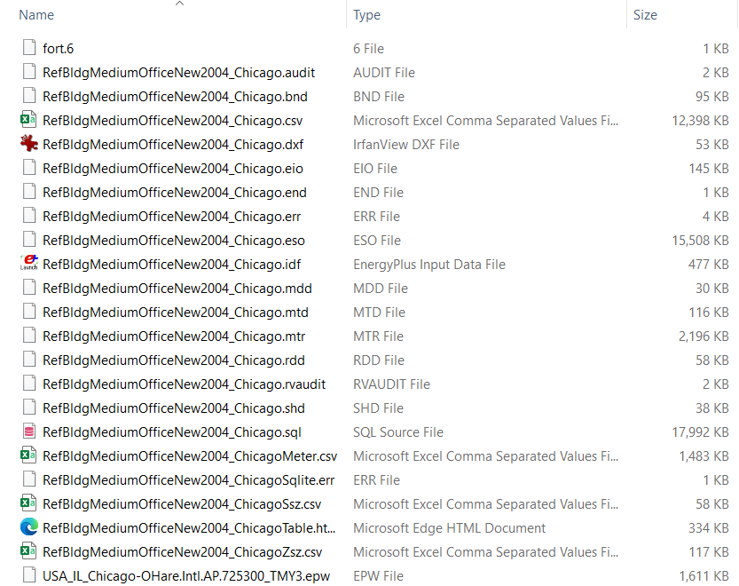
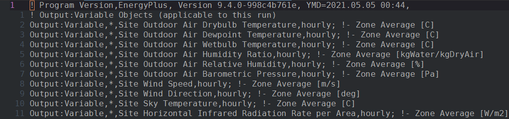
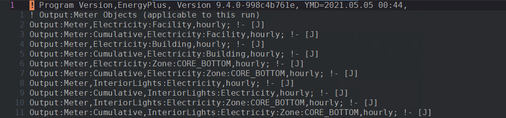
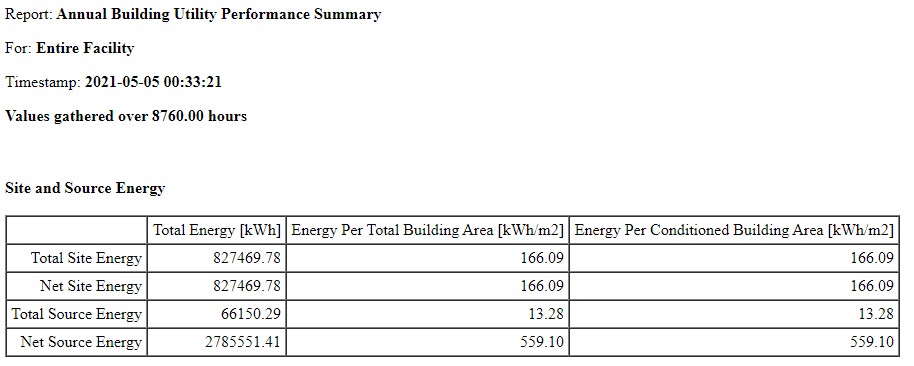
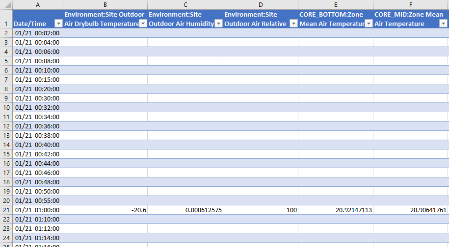
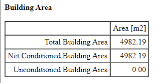
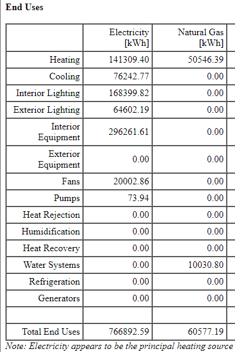

# Parametric simulations {#eplusr}

```{r include = FALSE}
usethis::proj_set(projpath)
```

```{r init-eplus, include = FALSE}
if (!eplusr::is_avail_eplus(9.4)) eplusr::install_eplus(9.4, local = TRUE)
```

This chapter demonstrates the process of performing parametric simulation
analyses using the `ParametricJob` class. It is based on the {eplusr}
[*Run simulation and data exploration*](https://hongyuanjia.github.io/eplusr/articles/job.html),
and
[*Parametric simulations*](https://hongyuanjia.github.io/eplusr/articles/param.html)
vignettes, together with steps on file management technique specific for a
research compendium.

Please note that this chapter will not go to the details on how to use {eplusr}
and EnergyPlus. For that, please check {eplusr}
[*Introduction to eplusr*](https://hongyuanjia.github.io/eplusr/articles/eplusr.html)
and other materials.

The main focuses of this chapter are:

1.  creating parametric models by applying measures and
2.  easing the comparative analysis by reusing code snippets developed in data exploration process.

## Prerequisites

This chapter focusses on {eplusr} and {tidyverse}. {eplusr} is used for
integrating EnergyPlus with R. {tidyverse} is used for performing data analyses.
We will also use {fs} for file system operation and {here} for
[project-oriented](https://www.tidyverse.org/blog/2017/12/workflow-vs-script/)
file path specification.

```{r}
library(usethis)   # for automating project setup

library(eplusr)    # for EnergyPlus and R integration
library(tidyverse) # for data analytics
library(fs)        # for file system operation
library(here)      # for project-oriented file path specification
```

```{r, include = FALSE}
# when loaded, here() will use current project instead of the one we created for
# demonstration
here <- function(...) proj_path(...)
```

Also, in order to perform building energy simulation, EnergyPlus v9.4 is needed.
If you havn't install it yet, please follow the instructions in [Prerequisites][EnergyPlus]
chapter.

If you installed EnergyPlus in the default location, {eplusr} should be able to
find it. You can check by running the code blow:

```{r avail-eplus}
is_avail_eplus(9.4)
```

If you installed EnergyPlus v9.4 in a custom location other than the default one,
you can specify the location using the `eplusr::use_eplus()` function.

```{r use-eplus, eval = FALSE}
use_eplus("/path/to/EnergyPlus/installation/directory")

is_avail_eplus(9.4)
```

## Basic workflow

The `ParametricJob` class in {eplusr} is a parametric prototype that provides a
set of abstractions to ease the process of parametric model generation, design
alternative evaluation, and large parametric simulation management.

An overview of the parametric prototype implementation is shown blow:

```{r, out.width = "60%"}
knitr::include_graphics("images/parametric.png")
```

## Include the raw data

First, we use `usethis::use_directory()` to create the `data-raw` folder which
will be used to store the raw simulation inputs, including the `IDF` file and
`EPW` file for example.

```{r create-dir-data-raw}
use_directory("data-raw")
```

For demonstration purpose, here we use the U.S. Department of Energy (DOE)
medium office reference building model [@field2010using] and TMY3 weather data
of Chicago Internal Airport. Both of them have already distributed together with
EnergyPlus v9.4.

```{r path-raw-input}
# get EnergyPlus v9.4 installation path
dir_eplus <- eplus_config(9.4)$dir

path_model <- path(dir_eplus, "ExampleFiles/RefBldgMediumOfficeNew2004_Chicago.idf")
path_weather <- path(dir_eplus, "WeatherData/USA_IL_Chicago-OHare.Intl.AP.725300_TMY3.epw")
```

We can copy them to the `data-raw` directory we just created by running:

```{r copy-raw-input}
file_copy(
    path = c(path_model, path_weather),
    new_path = here("data-raw", path_file(c(path_model, path_weather))),
    overwrite = TRUE
)

dir_ls(here("data-raw"))
```

## Run parametric simulation

## Start from individual simulation

Before we go for parametric simulations, it is good to first run a single
simulation and do EDA (exploratory data analysis) to get an image on how the
model the model looks like.

### `analysis` script

First, let's create a `analysis` folder using `usethis::use_directory("analysis")
` to store the code for performing simulation and the EDA.

```{r}
use_directory("analysis")
```

After that, we create an R script called `eda.R` under `analysis/` folder. You
can do that directly in RStudio, or by running the code blow:

```{r, eval = FALSE}
edit_file(here("analysis/eda.R"))
```

Copy the code blow to `analysis/eda/R` and run it by clicking
 or pressing
`Ctrl + Shift + Enter`.

```{r init-job, out.lines = 10}
path_idf <- here("data-raw/RefBldgMediumOfficeNew2004_Chicago.idf")
path_epw <- here("data-raw/USA_IL_Chicago-OHare.Intl.AP.725300_TMY3.epw")

idf <- read_idf(path_idf)

# make sure weather file input is respected
idf$SimulationControl$Run_Simulation_for_Weather_File_Run_Periods <- "Yes"

# make sure energy consumption is presented in kWh
idf$OutputControl_Table_Style$Unit_Conversion <- "JtoKWH"

# add meter outputs to get hourly time-series energy consumption
meters <- c(
    "Cooling:Electricity",
    "Heating:Electricity",
    "InteriorLights:Electricity",
    "ExteriorLights:Electricity",
    "InteriorEquipment:Electricity",
    "Fans:Electricity",
    "Pumps:Electricity"
)
idf$add(Output_Meter := list(meters, "Hourly"))

# save the modified model into a temporary folder
idf$save(path_temp("sim", path_file(idf$path())), overwrite = TRUE)

# run annual simulation
job <- idf$run(path_epw)
```

The summary of the simulation job can be printed by running:

```{r job-print}
job$print()
```

Once a model has been run using `$run()`, the simulation job can be retrieved by
calling:

```{r last-job}
job <- idf$last_job()
```

### Main EnergyPlus outputs

You can open the output directory by running

```{r, eval = FALSE}
job$output_dir(open = TRUE)
```

```{r output-dir, fig.cap = "EnergyPlus simulation outputs", echo = FALSE}

```

Table \@ref(tab:eplus-out) gives a summary of the main outputs from an
EnergyPlus simulation. For other output formats, you can find the documentation in
the [Output Details and Examples](https://bigladdersoftware.com/epx/docs/9-4/output-details-and-examples/index.html).

Table: (\#tab:eplus-out) Description on EnergyPlus main outputs

+----------------------+------------------------------------------+------------------------------------------------------------------------------------------------------------------------------------------------------------------------------------------------------------------+-----------------------------------+
| Output type          | Name                                     | Output                                                                                                                                                                                                           | Methods related                   |
+======================+==========================================+==================================================================================================================================================================================================================+===================================+
| ERR File             | `Model.err`                              | All of the warnings, errors, etc. that occur during the simulation.                                                                                                                                              | `EplusJob$errors()`               |
+----------------------+------------------------------------------+------------------------------------------------------------------------------------------------------------------------------------------------------------------------------------------------------------------+-----------------------------------+
| RDD File             | `Model.rdd`                              | All the report variables along with their **availability** for the current input file.                                                                                                                           | `EplusJob$read_rdd()`             |
+----------------------+------------------------------------------+------------------------------------------------------------------------------------------------------------------------------------------------------------------------------------------------------------------+-----------------------------------+
| MDD File             | `Model.mdd`                              | All the report meters along with their **availability** for the current input file.                                                                                                                              | `EplusJob$read_mdd()`             |
+----------------------+------------------------------------------+------------------------------------------------------------------------------------------------------------------------------------------------------------------------------------------------------------------+-----------------------------------+
| Tabular FIle         | `ModelTable.htm`, `ModelTable.csv`, etc. | All tabular output results that are created when using the following objects:                                                                                                                                    | `EplusJob$tabular_data()`         |
|                      |                                          |                                                                                                                                                                                                                  |                                   |
|                      |                                          | -   `Output:Table:SummaryReports`                                                                                                                                                                                |                                   |
|                      |                                          | -   `Output:Table:TimeBins`                                                                                                                                                                                      |                                   |
|                      |                                          | -   `Output:Table:Monthly`                                                                                                                                                                                       |                                   |
|                      |                                          | -   `UtilityCost:Tariff`                                                                                                                                                                                         |                                   |
|                      |                                          | -   `ComponentCost:Line Item`                                                                                                                                                                                    |                                   |
+----------------------+------------------------------------------+------------------------------------------------------------------------------------------------------------------------------------------------------------------------------------------------------------------+-----------------------------------+
| Report Variable Data | `Model.csv`                              | All report variable results that are created when using the `Output:Variable` object and the objects from `Output:Meter:*` classes without `MeterFileOnly`                                                       | -   `EplusJob$report_data_dict()` |
|                      |                                          |                                                                                                                                                                                                                  | -   `EplusJob$report_data()`      |
+----------------------+------------------------------------------+------------------------------------------------------------------------------------------------------------------------------------------------------------------------------------------------------------------+-----------------------------------+
| Report Meter Data    | `ModelMeter.csv`                         | All report meter results that are created when using the following objects:                                                                                                                                      | -   `EplusJob$report_data_dict()` |
|                      |                                          |                                                                                                                                                                                                                  | -   `EplusJob$report_data()`      |
|                      |                                          | -   `Output:Meter`                                                                                                                                                                                               |                                   |
|                      |                                          | -   `Output:Meter:MeterFileOnly`                                                                                                                                                                                 |                                   |
|                      |                                          | -   `Output:Meter:Cumulative`                                                                                                                                                                                    |                                   |
|                      |                                          | -   `Output:Meter:Cumulative:MeterFileOnly`                                                                                                                                                                      |                                   |
|                      |                                          | -   `Meter:Custom`                                                                                                                                                                                               |                                   |
|                      |                                          | -   `Meter:CustomDecrement`                                                                                                                                                                                      |                                   |
+----------------------+------------------------------------------+------------------------------------------------------------------------------------------------------------------------------------------------------------------------------------------------------------------+-----------------------------------+
| SQLite File          | `Model.sql`                              | SQLite database that includes all of the data found in the `MeterTable.html`, `Model.csv` and `ModelMeter.csv`, plus a number of other reports. This is also the actual file that {eplusr} uses to extract data. | -   `EplusJob$list_table()`       |
|                      |                                          |                                                                                                                                                                                                                  | -   `EplusJob$read_table()`       |
|                      |                                          |                                                                                                                                                                                                                  | -   `EplusJob$report_data_dict()` |
|                      |                                          |                                                                                                                                                                                                                  | -   `EplusJob$report_data()`      |
|                      |                                          |                                                                                                                                                                                                                  | -   `EplusJob$tabular_data()`     |
+----------------------+------------------------------------------+------------------------------------------------------------------------------------------------------------------------------------------------------------------------------------------------------------------+-----------------------------------+

#### ERR file

`$errors()` method


```{r errors}
job$errors()
```

#### RDD and MDD

```{r rdd-vim, fig.cap = "An example of RDD file"}

```

```{r mdd-vim, fig.cap = "An example of MDD file"}

```

`$rdd()` method

```{r read-rdd}
job$read_rdd()
```

`$mdd()` method

```{r read-mdd}
job$read_mdd()
```

`rdd_to_load()` and `mdd_to_load()`


```{r, eval = FALSE}
job$read_rdd() %>% rdd_to_load() %>% idf$load()

job$read_mdd() %>% mdd_to_load() %>% idf$load()
```

Below gives you an example of adding new output variables into the model. It
selects all variables that starts with `People` with a unit of `W` for all
people objects (by setting `key_value` to `"*"`) and hourly frequency. Please
note that this change will take effect when we save this modified model and
rerun the simulation.

```{r load-rdd}
job$read_rdd() %>%
    filter(str_starts(variable, "People"), units == "W") %>%
    rdd_to_load(key_value = "*", reporting_frequency = "Hourly") %>%
    idf$load()
```

#### Tabular output

You can open the result summary table HTML file and the csv output file by
running:

```{r open-tabular, eval = FALSE}
shell(job$locate_output("Table.htm"))
```

The tabular output contains quite a lot of tables. Every table has an associated
*Report* name, *For* name, *Table* name. Fig. \@ref(fig:tabular-eui) gives the
an example of a table in the tabular output. In this case, the *Report* name is
`Annual Building Utility Performance Summary`, the *For* name is `Entire
Facility`, and the *Table* name is `Site and Source Energy`.

```{r tabular-eui, echo = FALSE, fig.cap = "Site and source energy report from tabular output"}

```

With all this information, we can easily extract the above table using the
`$tabluar_data()` method:

```{r tabular-eui-data}
job$tabular_data(
    report_name = "AnnualBuildingUtilityPerformanceSummary",
    report_for = "Entire Facility",
    table_name = "Site and Source Energy"
)

```

You may find that the table format you get using `$tabular_data()` is different
from what you see in Fig. \@ref(fig:tabular-eui). {eplusr} does this by purpose.
The format is a *Tidy* table [@wickham2014tidy] and can streamline the data
analysis process when using {tidyverse}. I will demonstrate this later [REF].

If you still like to format it in the similar way as Fig. \@ref(fig:tabular-eui),
you can do it by setting `wide` to `TRUE`:

```{r tabular-eui-data-wide}
job$tabular_data(
    report_name = "AnnualBuildingUtilityPerformanceSummary",
    report_for = "Entire Facility",
    table_name = "Site and Source Energy",
    wide = TRUE
)
```

#### Report variable and meter outputs

You can open the report output by running:

```{r open-csv, eval = FALSE}
shell(job$locate_output(".csv"))
```

Fig. \@ref(fig:csv-excel) gives an example of the report variable and meter outputs. There are several things to notice:

- `Date/Time` column starts from `01/21` (January 21th), but not not `01/01`
  (January 1st). Actually you will find the first occurrence of `01/01` at
  row 628. This is because EnergyPlus will always report the outputs from
  the *Design Day* simulation.

- There are quite a lot missing values. For example, the first non-missing
  value for outdoor air drybulb temperature is at row 21 with time stamp of
  `01/21 01:00:00`. This is expected because the reporting frequency for that
  variable is set to `Hourly`. We can validate this by running:

    ```{r}
    idf$to_table(class = "Output:Variable", wide = TRUE) %>%
        filter(`Variable Name` == "Site Outdoor Air Drybulb Temperature")
    ```
    There should be variables with a smaller reporting frequency and values for variables with bigger frequency have to be empty in order to put them in a same table. We can find variables which do not have a `Hourly` reporting frequency by running:

    ```{r}
    idf$to_table(class = "Output:Variable", wide = TRUE) %>%
        filter(str_to_lower(`Reporting Frequency`) != "hourly") %>%
        select(`Variable Name`, `Reporting Frequency`)
    ```
    We can see that `Performance Curve Output Variable` has a smaller reporting
    frequency of `detailed`, which means that it will be reported at every HVAC
    time step.

    * Several information are concatenated in column headers. For example,
      including variable Key Value, Variable Name, Units and Reporting
      Frequency. Takes the second column `Environment:Site Outdoor Air Humidity
      Ratio [kgWater/kgDryAir](Hourly)` as an example:
        - Key Value: `Environment`
        - Variable Name: `Site Outdoor Air Humidity Ratio`
        - Unit: `kgWater/kgDryAir`
        - Reporting Frequency: `Hourly`
     While this compact column format provides efficient storage for completely
     crossed designs, it makes hard to perform operations like filtering
     variable names. Additional data cleaning efforts are needed to work with
     this structure. And that's exactly the reason why {eplusr} will not
     directly read EnergyPlus CSV output but instead using the SQLite database
     which provides much structured data that is easily to process in R.

```{r csv-excel, echo = FALSE, fig.cap = "Report variable and meter outputs in CSV format"}

```

#### SQLite

Table (a) in Fig. \@ref(fig:tidy-format) shows an example of the standard format
from EnergyPlus CSV table output, while Table (b) gives the tidy representation
of the same underlying data using {eplusr} tidy data interface.  In Table (b),
values in column headers have been extracted and converted into separate columns,
and a new variable called `Value` is used to store the concatenated data values
from the previously separate columns.  Moreover, instead of presenting date and
time as strings in Table (a), the tidy data interface splits its components into
four new variables, including `Month`, `Day`, `Hour` and `Minute`.  Taken
together, Table (b) forms a nine-variable tidy table and each variable matches
the semantics of simulation output.  This format can facilitate initial
exploration and analysis of data and to simplify the development of data
analysis tools that work well together [@wickham2014tidy].

```{r tidy-format, echo = FALSE, fig.cap = "EnergyPlus output data in Tidy format"}
knitr::include_graphics("images/tidy-format.png")
```

```{r report-data-tdb}
job$report_data(
    name = "Site Outdoor Air Drybulb Temperature",
    month = 7, day = 1:7,
    day_type = "normalday"
)
```

A detailed description on the columns can be found in
[doc](https://bigladdersoftware.com/epx/docs/9-4/output-details-and-examples/eplusout-sql.html#reportdatadictionary-table)

```{r report-data-dict}
job$report_data_dict()
```

```{r}
job$list_table()
```

A detailed description on the tables can be found in
[doc](https://bigladdersoftware.com/epx/docs/9-4/output-details-and-examples/eplusout-sql.html#eplusout.sql)

You can read a single table using `$read_table()` method. For example, we can
read the `Schedules` table by running:

```{r read-table}
job$read_table("Schedules")
```

```{r, eval = FALSE}
# read building area from Standard Reports
area <- job$tabular_data(table_name = "Building Area", wide = TRUE)[[1]]

# extract hourly energy consumption from Output Meter with all meta data
mtr <- job$report_data(name = meters,
    environment_name = "annual",
    interval = 60, all = TRUE
)

# extract hourly outdoor air dry-bulb temperature and zone air temperature from Output Variable
temp <- job$report_data(
    name = c("site outdoor air drybulb temperature", "zone mean air temperature"),
    environment_name = "annual",
    interval = 60
)
```

### Data exploration

#### Energy comsumption contributions

```{r}

```

```{r}

```

#### Indoor temperature vs Outdoor temperature

```{r, eval = FALSE}
library(esquisse)
```

```{r, eval = FALSE}
job$tabular_data()
```

```{r, eval = FALSE}
# calculate monthly energy consumption per total floor area
mtr_monthly <- mtr %>%
    # group by month and energy consumption subcategory
    group_by(month, name) %>%
    summarize(
        date = lubridate::date(datetime)[1],
        value = sum(value) / area[["Area [m2]"]][1]
    ) %>%
    mutate(name = str_replace(name, ":Electricity", ""))
```

```{r, eval = FALSE}
esquisse::esquisser(mtr_monthly)

# # extract energy consumption of heating and cooling with outdoor air temperature
# mtr_temp <- mtr %>%
#     filter(str_detect(name, "Heating|Cooling")) %>%
#     mutate(name = str_replace(name, ":Electricity", "")) %>%
#     left_join(temp %>% select(datetime, value), "datetime", suffix = c("", "_temp"))

# colorblind-friendly palette
pal_cb <- c(
    Heating = "#CC79A7", Cooling = "#0072B2", Fans = "#56B4E9",
    InteriorLights = "#F0E442", ExteriorLights = "#999999",
    InteriorEquipment = "#E69F00", Pumps = "#D55E00"
)

# plot an area chart to show energy consumption over months
p_eui <- mtr_monthly %>%
    mutate(name = fct_relevel(name, names(pal_cb))) %>%
    ggplot(aes(date, value, fill = name)) +
    geom_area(color = NA) +
    scale_x_date(NULL, date_breaks = "1 month", date_labels = "%b", expand = c(0, 0)) +
    scale_y_continuous(expression("Energy consumption ["*kWh/m^2*"]"),
        labels = scales::label_number(0.1, 1/3.6E6), limits = c(0, 20*3.6E6),
        expand = c(0, 0)
    ) +
    scale_fill_manual(values = pal_cb, labels = names(pal_cb)) +
    guides(fill = guide_legend(title = NULL, nrow = 2)) +
    theme_minimal() +
    theme(legend.position = c(0.5, 0.9))
p_eui
```
