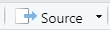

# Parametric simulations {#eplusr}

```{r include = FALSE}
usethis::proj_set(projpath)

print_table <- function(x, nrows = 10, ...) {
    if (!knitr::is_latex_output()) {
        rmarkdown::paged_table(head(x, nrows))
    } else {
        knitr::kable(head(x, nrows), booktabs = TRUE, linesep = "", ...)
    }
}

options(progress_enabled = FALSE)
```

```{r init-eplus, include = FALSE}
if (!eplusr::is_avail_eplus(9.4)) eplusr::install_eplus(9.4, local = TRUE)
```

This chapter demonstrates the process of performing parametric simulation
analyses using the `ParametricJob` class. It is based on the {eplusr}
[*Run simulation and data exploration*](https://hongyuanjia.github.io/eplusr/articles/job.html),
and
[*Parametric simulations*](https://hongyuanjia.github.io/eplusr/articles/param.html)
vignettes, together with steps on file management technique specific for a
research compendium.

Please note that this chapter will not go to the details on how to use {eplusr}
and EnergyPlus. For that, please check {eplusr}
[*Introduction to eplusr*](https://hongyuanjia.github.io/eplusr/articles/eplusr.html)
and other materials.

The main focuses of this chapter are:

1.  to show how to create parametric models by applying measures using {eplusr} and
2.  to demonstrate the data analyses of simulation outputs using {tidyverse}

## Prerequisites

This chapter focusses on {eplusr} and {tidyverse}. {eplusr} is used for
integrating EnergyPlus with R. {tidyverse} is used for performing data analyses.
We will also use {fs} for file system operation and {here} for
[project-oriented](https://www.tidyverse.org/blog/2017/12/workflow-vs-script/)
file path specification.

```{r}
library(usethis)   # for automating project setup

library(eplusr)    # for EnergyPlus and R integration
library(tidyverse) # for data analytics
library(fs)        # for file system operation
library(here)      # for project-oriented file path specification
```

```{r, include = FALSE}
# when loaded, here() will use current project instead of the one we created for
# demonstration
here <- function(...) proj_path(...)
```

Also, in order to perform building energy simulation, EnergyPlus v9.4 is needed.
If you havn't install it yet, please follow the instructions in
[Prerequisites][EnergyPlus] chapter.

If you installed EnergyPlus in the default location, {eplusr} should be able to
find it. You can check by running the code blow:

```{r avail-eplus}
is_avail_eplus(9.4)
```

If you installed EnergyPlus v9.4 in a custom location other than the default one,
you can specify the location using the `eplusr::use_eplus()` function.

```{r use-eplus, eval = FALSE}
use_eplus("/path/to/EnergyPlus/installation/directory")

is_avail_eplus(9.4)
```

## Include the raw data

First, we use `usethis::use_directory()` to create the `data-raw` folder which
will be used to store the raw simulation inputs, including the `IDF` file and
`EPW` file for example.

```{r create-dir-data-raw}
use_directory("data-raw")
```

For demonstration purpose, here we use the U.S. Department of Energy (DOE)
medium office reference building model [@field2010using] and TMY3 weather data
of Chicago Internal Airport. Both of them have already distributed together with
EnergyPlus v9.4.

```{r path-raw-input}
# get EnergyPlus v9.4 installation path
dir_eplus <- eplus_config(9.4)$dir

path_model <- path(dir_eplus, "ExampleFiles/RefBldgMediumOfficeNew2004_Chicago.idf")
path_weather <- path(dir_eplus, "WeatherData/USA_IL_Chicago-OHare.Intl.AP.725300_TMY3.epw")
```

We can copy them to the `data-raw` directory we just created by running:

```{r copy-raw-input}
file_copy(
    path = c(path_model, path_weather),
    new_path = here("data-raw", path_file(c(path_model, path_weather))),
    overwrite = TRUE
)

dir_ls(here("data-raw"))
```

## Run a single simulation

Before we go for parametric simulations, it is good to first run a single
simulation and do EDA (exploratory data analysis) to get an image on how the
model the model looks like.

### `analysis` script

First, let's create a `analysis` folder using `usethis::use_directory("analysis")
` to store the code for performing simulation and the EDA.

```{r}
use_directory("analysis")
```

After that, we create an R script called `eda.R` under `analysis/` folder. You
can do that directly in RStudio, or by running the code blow:

```{r, eval = FALSE}
edit_file(here("analysis/eda.R"))
```

Copy the code blow to `analysis/eda/R` and run it by clicking
{#id width=10% style="vertical-align:middle;width:10%" display=inline-block}
or pressing `Ctrl + Shift + Enter`. What the code below does is:

1. Specify the model and weather file path based on the project using `here::here()`
1. Read the model in R using `eplusr::read_idf()`
1. Modify the `SimulationControl` object to use weather file for simulations
1. Modify the `OutputControl:Table:Style` object to change the units in tabular
   output to `kWh`
1. Add hourly energy consumption under various categories in `Output:Meter`
   class using `Idf$add()` method
1. Save the modified model into a temporary folder using `Idf$save()` method
1. Run the simulation using `Idf$run()` method and assign the simulation to an
   `EplusJob` object named `job`

```{r init-job, out.lines = 10}
path_idf <- here("data-raw/RefBldgMediumOfficeNew2004_Chicago.idf")
path_epw <- here("data-raw/USA_IL_Chicago-OHare.Intl.AP.725300_TMY3.epw")

idf <- read_idf(path_idf)

# make sure weather file input is respected
idf$SimulationControl$Run_Simulation_for_Weather_File_Run_Periods <- "Yes"

# make sure energy consumption is presented in kWh
idf$OutputControl_Table_Style$Unit_Conversion <- "JtoKWH"

# add meter outputs to get hourly time-series energy consumption
meters <- c(
    "Cooling:Electricity",
    "Heating:Electricity",
    "InteriorLights:Electricity",
    "ExteriorLights:Electricity",
    "InteriorEquipment:Electricity",
    "Fans:Electricity",
    "Pumps:Electricity"
)
idf$add(Output_Meter := list(meters, "Hourly"))

# save the modified model into a temporary folder
idf$save(path_temp("sim", path_file(idf$path())), overwrite = TRUE)

# run annual simulation
job <- idf$run(path_epw)
```

When the simulation completes, the summary of the simulation job can be printed
by running:

```{r job-print}
job$print()
```

Once a model has been run using `$run()`, the simulation job can be retrieved by
calling:

```{r last-job}
job <- idf$last_job()
```

## Main EnergyPlus outputs

EnergyPlus gives quite a lot outputs. You can open the output directory by
running:

```{r, eval = FALSE}
job$output_dir(open = TRUE)
```

```{r output-dir, fig.cap = "EnergyPlus simulation outputs", echo = FALSE}
knitr::include_graphics("images/output_dir.png")
```

Table \@ref(tab:eplus-out) gives a summary of the main outputs from an
EnergyPlus simulation. For other output formats, you can find description in
EnergyPlus documentation
[Output Details and Examples](https://bigladdersoftware.com/epx/docs/9-4/output-details-and-examples/index.html).

Table: (\#tab:eplus-out) Description on EnergyPlus main outputs

+----------------------+------------------------------------------+------------------------------------------------------------------------------------------------------------------------------------------------------------------------------------------------------------------+-----------------------------------+
| Output type          | Name                                     | Output                                                                                                                                                                                                           | Methods related                   |
+======================+==========================================+==================================================================================================================================================================================================================+===================================+
| ERR File             | `Model.err`                              | All of the warnings, errors, etc. that occur during the simulation.                                                                                                                                              | `EplusJob$errors()`               |
+----------------------+------------------------------------------+------------------------------------------------------------------------------------------------------------------------------------------------------------------------------------------------------------------+-----------------------------------+
| RDD File             | `Model.rdd`                              | All the report variables along with their **availability** for the current input file.                                                                                                                           | `EplusJob$read_rdd()`             |
+----------------------+------------------------------------------+------------------------------------------------------------------------------------------------------------------------------------------------------------------------------------------------------------------+-----------------------------------+
| MDD File             | `Model.mdd`                              | All the report meters along with their **availability** for the current input file.                                                                                                                              | `EplusJob$read_mdd()`             |
+----------------------+------------------------------------------+------------------------------------------------------------------------------------------------------------------------------------------------------------------------------------------------------------------+-----------------------------------+
| Tabular FIle         | `ModelTable.htm`, `ModelTable.csv`, etc. | All tabular output results that are created when using the following objects:                                                                                                                                    | `EplusJob$tabular_data()`         |
|                      |                                          |                                                                                                                                                                                                                  |                                   |
|                      |                                          | -   `Output:Table:SummaryReports`                                                                                                                                                                                |                                   |
|                      |                                          | -   `Output:Table:TimeBins`                                                                                                                                                                                      |                                   |
|                      |                                          | -   `Output:Table:Monthly`                                                                                                                                                                                       |                                   |
|                      |                                          | -   `UtilityCost:Tariff`                                                                                                                                                                                         |                                   |
|                      |                                          | -   `ComponentCost:Line Item`                                                                                                                                                                                    |                                   |
+----------------------+------------------------------------------+------------------------------------------------------------------------------------------------------------------------------------------------------------------------------------------------------------------+-----------------------------------+
| Report Variable Data | `Model.csv`                              | All report variable results that are created when using the `Output:Variable` object and the objects from `Output:Meter:*` classes without `MeterFileOnly`                                                       | -   `EplusJob$report_data_dict()` |
|                      |                                          |                                                                                                                                                                                                                  | -   `EplusJob$report_data()`      |
+----------------------+------------------------------------------+------------------------------------------------------------------------------------------------------------------------------------------------------------------------------------------------------------------+-----------------------------------+
| Report Meter Data    | `ModelMeter.csv`                         | All report meter results that are created when using the following objects:                                                                                                                                      | -   `EplusJob$report_data_dict()` |
|                      |                                          |                                                                                                                                                                                                                  | -   `EplusJob$report_data()`      |
|                      |                                          | -   `Output:Meter`                                                                                                                                                                                               |                                   |
|                      |                                          | -   `Output:Meter:MeterFileOnly`                                                                                                                                                                                 |                                   |
|                      |                                          | -   `Output:Meter:Cumulative`                                                                                                                                                                                    |                                   |
|                      |                                          | -   `Output:Meter:Cumulative:MeterFileOnly`                                                                                                                                                                      |                                   |
|                      |                                          | -   `Meter:Custom`                                                                                                                                                                                               |                                   |
|                      |                                          | -   `Meter:CustomDecrement`                                                                                                                                                                                      |                                   |
+----------------------+------------------------------------------+------------------------------------------------------------------------------------------------------------------------------------------------------------------------------------------------------------------+-----------------------------------+
| SQLite File          | `Model.sql`                              | SQLite database that includes all of the data found in the `MeterTable.html`, `Model.csv` and `ModelMeter.csv`, plus a number of other reports. This is also the actual file that {eplusr} uses to extract data. | -   `EplusJob$list_table()`       |
|                      |                                          |                                                                                                                                                                                                                  | -   `EplusJob$read_table()`       |
|                      |                                          |                                                                                                                                                                                                                  | -   `EplusJob$report_data_dict()` |
|                      |                                          |                                                                                                                                                                                                                  | -   `EplusJob$report_data()`      |
|                      |                                          |                                                                                                                                                                                                                  | -   `EplusJob$tabular_data()`     |
+----------------------+------------------------------------------+------------------------------------------------------------------------------------------------------------------------------------------------------------------------------------------------------------------+-----------------------------------+

### ERR file

This file is very important to every simulation run. This should always be the
first file you check after a simulation. All of the warnings, errors, etc. that
occur during the run will show up in this file.  The error message should supply
you with enough information to find the line with the error.  More details on
error message formatting and some standard error messages are described in
EnergyPlus
[Tips and Tricks](https://bigladdersoftware.com/epx/docs/9-4/tips-and-tricks-using-energyplus/index.html).
document.

To see the ERR file contents in R, you can use `EplusJob$errors()` method:

```{r errors}
job$errors()
```

### RDD and MDD file

The RDD amd MDD file can be used as a source to find particular output of
interest and add them to the model. Fig. \@ref(fig:rdd-vim) and Fig.
\@ref(fig:mdd-vim) give an example of each.

```{r rdd-vim, echo = FALSE, fig.cap = "An example of RDD file"}
knitr::include_graphics("images/rdd.png")
```

```{r mdd-vim, echo = FALSE, fig.cap = "An example of MDD file"}
knitr::include_graphics("images/mdd.png")
```

The `EplusJob` class in {eplusr} package also has dedicated methods to read the
RDD and MDD in R, i.e. `EplusJob$read_rdd()` and `EplusJob$read_mdd()`,
respectively. They all return a `data.frame`:

```{r read-rdd, eval = FALSE}
job$read_rdd()
```

```{r read-rdd-tbl, echo = FALSE}
print_table(job$read_rdd())
```

```{r read-mdd, eval = FALSE}
job$read_mdd()
```

```{r read-mdd-tbl, echo = FALSE}
print_table(job$read_mdd())
```

If you want to insert new outputs into the model, you can pass your selected
outputs of interest to `eplusr::rdd_to_load()` and `eplusr::mdd_to_load()`, then
use the `Idf$load()` method to add them.

```{r, eval = FALSE}
job$read_rdd() %>% rdd_to_load() %>% idf$load()

job$read_mdd() %>% mdd_to_load() %>% idf$load()
```

Below gives you an example of adding new output variables into the model. It
selects all variables that starts with `People` with a unit of `W` for all
related objects (by setting `key_value` to `"*"`) and hourly frequency. Please
note that this change will take effect when we save this modified model and
**rerun the simulation**.

```{r load-rdd}
job$read_rdd() %>%
    filter(str_starts(variable, "People"), units == "W") %>%
    rdd_to_load(key_value = "*", reporting_frequency = "Hourly") %>%
    idf$load()
```

### Tabular output

You can open the result tabular HTML file by running:

```{r open-tabular, eval = FALSE}
shell(job$locate_output("Table.htm"))
```

The tabular output contains quite a lot of tables. Every table has an associated
*Report* name, *For* name, *Table* name. Fig. \@ref(fig:tabular-eui) gives the
an example of a table in the tabular output. In this case, the *Report* name is
`Annual Building Utility Performance Summary`, the *For* name is `Entire
Facility`, and the *Table* name is `Site and Source Energy`.

```{r tabular-eui, echo = FALSE, fig.cap = "Site and source energy report from tabular output"}
knitr::include_graphics("images/eui.png")
```

With all this information, we can easily extract the above table using the
`$tabluar_data()` method:

```{r tabular-eui-data, eval = FALSE}
job$tabular_data(
    report_name = "AnnualBuildingUtilityPerformanceSummary",
    report_for = "Entire Facility",
    table_name = "Site and Source Energy"
)
```

```{r tabular-eui-data-tbl, echo = FALSE}
eui <- job$tabular_data(
    report_name = "AnnualBuildingUtilityPerformanceSummary",
    report_for = "Entire Facility",
    table_name = "Site and Source Energy"
)
print_table(eui)
```

You may find that the table format you get using `$tabular_data()` is different
from what you see in Fig. \@ref(fig:tabular-eui). {eplusr} does this by purpose.
The format is a *Tidy* table [@wickham2014tidy] and can streamline the data
analysis process when using {tidyverse}. I will demonstrate this later [REF].

If you still like to format it in the similar way as Fig. \@ref(fig:tabular-eui),
you can do it by setting `wide` to `TRUE`:

```{r tabular-eui-data-wide, eval = FALSE}
job$tabular_data(
    report_name = "AnnualBuildingUtilityPerformanceSummary",
    report_for = "Entire Facility",
    table_name = "Site and Source Energy",
    wide = TRUE
)
```

```{r tabular-eui-data-wide-tbl, echo = FALSE}
eui <- job$tabular_data(
    report_name = "AnnualBuildingUtilityPerformanceSummary",
    report_for = "Entire Facility",
    table_name = "Site and Source Energy"
)
print_table(eui)
```

### Report variable and meter outputs

You can open the report output by running:

```{r open-csv, eval = FALSE}
shell(job$locate_output(".csv"))
```

Fig. \@ref(fig:csv-excel) gives an example of the report variable and meter
outputs.

```{r csv-excel, echo = FALSE, fig.cap = "Report variable and meter outputs in CSV format"}
knitr::include_graphics("images/report_csv.png")
```

There are several things to notice:

- `Date/Time` column starts from `01/21` (January 21th), but not not `01/01`
  (January 1st). Actually you will find the first occurrence of `01/01` at
  row 628. This is because EnergyPlus will always report the outputs from
  the *Design Day* simulation.

- There are quite a lot missing values. For example, the first non-missing
  value for outdoor air drybulb temperature is at row 21 with time stamp of
  `01/21 01:00:00`. This is expected because the reporting frequency for that
  variable is set to `Hourly`. We can validate this by running:

    ```{r}
    idf$to_table(class = "Output:Variable", wide = TRUE) %>%
        filter(`Variable Name` == "Site Outdoor Air Drybulb Temperature")
    ```
    There should be variables with a smaller reporting frequency and values for variables with bigger frequency have to be empty in order to put them in a same table. We can find variables which do not have a `Hourly` reporting frequency by running:

    ```{r}
    idf$to_table(class = "Output:Variable", wide = TRUE) %>%
        filter(str_to_lower(`Reporting Frequency`) != "hourly") %>%
        select(`Variable Name`, `Reporting Frequency`)
    ```
    We can see that `Performance Curve Output Variable` has a smaller reporting
    frequency of `detailed`, which means that it will be reported at every HVAC
    time step.

- Several information are concatenated in column headers. For example,
  including variable Key Value, Variable Name, Units and Reporting
  Frequency. Takes the second column `Environment:Site Outdoor Air Humidity
  Ratio [kgWater/kgDryAir](Hourly)` as an example:
    - Key Value: `Environment`
    - Variable Name: `Site Outdoor Air Humidity Ratio`
    - Unit: `kgWater/kgDryAir`
    - Reporting Frequency: `Hourly`

  While this compact column format provides efficient storage for completely
  crossed designs, it makes hard to perform operations like filtering variable
  names. Additional data cleaning efforts are needed to work with this
  structure. And that's exactly the reason why {eplusr} will not directly read
  EnergyPlus CSV output but instead using the *SQLite* database which provides
  much structured data that is easily to process in R.

### SQLite output

Table (a) in Fig. \@ref(fig:tidy-format) shows an example of the standard format
from EnergyPlus CSV table output, while Table (b) gives the tidy representation
of the same underlying data using {eplusr} tidy data interface.

In Table (b), values in column headers have been extracted and converted into
separate columns, and a new variable called `Value` is used to store the
concatenated data values from the previously separate columns.  Moreover,
instead of presenting date and time as strings in Table (a), the tidy data
interface splits its components into four new variables, including `Month`,
`Day`, `Hour` and `Minute`.

Taken together, Table (b) forms a nine-variable tidy table and each variable
matches the semantics of simulation output.  This format can facilitate initial
exploration and analysis of data and to simplify the development of data
analysis tools that work well together [@wickham2014tidy].

```{r tidy-format, echo = FALSE, out.width = "70%", fig.cap = "EnergyPlus output data in Tidy format"}
knitr::include_graphics("images/tidy-format.png")
```

Below gives an example of using `EplusJob$report_data()` method to extract
data for:

- Variable name: `Site Outdoor Air Drybulb Temperature`
- Time period: July 1-7
- Excluding any data for design day

```{r report-data-tdb-fake, eval = FALSE}
job$report_data(
    name = "Site Outdoor Air Drybulb Temperature",
    month = 7, day = 1:7,
    day_type = "normalday"
)
```

```{r report-data-tdb, echo = FALSE}
vars <- job$report_data(
    name = "Site Outdoor Air Drybulb Temperature",
    month = 7, day = 1:7,
    day_type = "normalday"
)
print_table(vars)
```

A detailed description on the columns can be found in EnergyPlus
[Output Details and Examples](https://bigladdersoftware.com/epx/docs/9-4/output-details-and-examples/eplusout-sql.html#reportdatadictionary-table)
document.

If you want to know all the output for current simulation, you can use
`EplusJob$report_data_dict()` method:

```{r report-data-dict-fake, eval = FALSE}
job$report_data_dict()
```

Besides the tables above, EnergyPlus SQLite output also contains a lot other useful tables.
You can get all the table names by running:

```{r list-table, out.lines = 10}
job$list_table()
```

A detailed description on those table can be found
[here](https://bigladdersoftware.com/epx/docs/9-4/output-details-and-examples/eplusout-sql.html#eplusout.sql)

You can read a single table using `EplusJob$read_table()` method. For example,
we can read the `Schedules` table by running:

```{r read-table-fake, eval = FALSE}
job$read_table("Schedules")
```

```{r read-table, echo = FALSE}
print_table(job$read_table("Schedules"))
```

## Data exploration

Data exploration is an essential aspect of building energy simulation.
Once we have the capacity to read the simulation output in R, we can use the
rich toolkit provide by {tidyverse} and other great packages to perform data
analyses.

To give you a sense on the typical workflow, in this example, we will
demonstrates the data exploration process in the aspect of energy comsumptions
from different categories

### Energy comsumption contributions

The tabular output gives an end-use table like Fig. \@ref(fig:end-use).

```{r end-use, echo = FALSE, out.width = "30%", fig.cap = "Ene uses in tabular output"}
knitr::include_graphics("images/end_use.png")
```

```{r end-use-table}
end_use <- job$tabular_data(table_name = "End Uses", wide = TRUE)[[1]]
```

However, in order to calculate the enregy consumption per area, we need building
area (Fig. \@ref(fig:building-area)):

```{r building-area, echo = FALSE, out.width = "30%", fig.cap = "Building area in tabular output"}
knitr::include_graphics("images/building_area.png")
```

```{r building-area-table}
bldg_area <- job$tabular_data(table_name = "Building Area", wide = TRUE)[[1]]
```

We can define a function `read_end_use()` that takes a simulation job, extract
end uses and building area, and calculate the electricity per area in kWh/m^2 in
each category:

```{r}
read_end_use <- function(job) {
    end_use <- job$tabular_data(table_name = "End Uses", wide = TRUE)[[1]] %>%
        select(case, category = row_name, electricity = `Electricity [kWh]`)

    bldg_area <- job$tabular_data(table_name = "Building Area", wide = TRUE)[[1]] %>%
        select(case, category = row_name, area = `Area [m2]`) %>%
        filter(category == "Total Building Area") %>%
        select(case, area)

    end_use %>%
        left_join(bldg_area, "case") %>%
        mutate(electricity_per_area = electricity / area) %>%
        select(-area)
}
```

Below the `plot_end_use()` function takes the results from `read_end_use()` and
plot a pie chart using the {ggplot2} package.

```{r}
plot_end_use <- function(end_use) {
    end_use %>%
        filter(category != "Total End Uses") %>%
        mutate(proportion = electricity_per_area / sum(electricity_per_area)) %>%
        filter(proportion > 0.01) %>%
        mutate(ypos = cumsum(proportion)- 0.5 * proportion) %>%
        mutate(category = forcats::fct_relevel(category, "Heating", after = Inf)) %>%
        ggplot(aes("", proportion, fill = category)) +
        geom_bar(stat = "identity", width = 1, color = NA, size = 0.2) +
        geom_text(aes(x = 1.2,
                label = sprintf("%s:\n%s", category, scales::percent(proportion, 0.1))),
            position = position_stack(vjust = 0.5), size = 4, color = "grey30",
            fontface = "bold") +
        coord_polar("y", start = 0) +
        theme_void() +
        theme(legend.position = "none") +
        paletteer::scale_fill_paletteer_d("rcartocolor::Temps")
}
```

Now we can pass the simulation job to get the final chart.

```{r pie-eui, fig.cap = "Energy consumption", fig.width = 5, fig.height = 5, out.width = "60%"}
job %>% read_end_use() %>% plot_end_use()
```

## Run parametric simulations

### Basic workflow

As shown in Fig. \@ref(fig:pie-eui), the plug loads and interior lighting
systems consumed more than 60% of total electricity.
In this example, we will use parametric simulations to investigate the
energy-saving potentials of ECMs on reducing the plug loads and LPD.

The `ParametricJob` class in {eplusr} is a parametric prototype that provides a
set of abstractions to ease the process of parametric model generation, design
alternative evaluation, and large parametric simulation management.

An overview of the parametric prototype implementation is shown blow:

```{r parametric, echo = FALSE, out.width = "60%", fig.cap = "Overview of parametric simulation workflow in R"}
knitr::include_graphics("images/parametric.png")
```

The main steps to perform a parametric simulations are:

- Initialize a parametric job using a seed model and a weather file using
  `eplusr::param_job()`.

- Specify design alternatives by applying a *measure* function to the seed
  model.

  A measure is simply an R function that takes an `Idf` object and any other
  parameters (e.g. $t_1$ to $t_5$ in Fig. \@ref(fig:parametric)) as input, and
  returns a set of modified `Idf` objects as output, making it possible to
  leverage other modules in the framework and apply statistical methods and
  libraries existing in R to generate design options.

- After a measure is defined, use it and and other parameter values to method
  `$apply_measure()` to create a set of models.

- Call the `$run()` method to run all parametric simulations in parallel and
  place each simulation outputs in a separate folder. All simulation metadata
  will keep updating during the whole time and can be retrieved using the
  `$status()` method for further investigations.

- After the simulations complete, use `$report_data()`, `$tabular_data()`,
  `$read_table()`, etc. to extract simulation results. An extra column
  containing the simulation job identifiers is prepended in each table. It can
  be used as an index or key for further data transformations, analyses and
  visualization to compare results of different simulated design options.

### Create a ParametricJob object

We can use `eplusr::param_job()` to initialize a parametric simulation job.
Here, we use the same model and weather file used in the previous simulation.

```{r init-parm}
path_idf <- here("data-raw/RefBldgMediumOfficeNew2004_Chicago.idf")
path_epw <- here("data-raw/USA_IL_Chicago-OHare.Intl.AP.725300_TMY3.epw")

param <- param_job(path_idf, path_epw)
```

### Define measure functions

#### Preprocess the model

As described in [Run a single simulation], the model by default only runs design
day simulations. Also, additional meter outputs need to be added.

Basically we can just copy all the code in [Run a single simulation], and put it
into a function:

```{r preproc-idf}
preprocess_idf <- function(idf) {
    # make sure weather file input is respected
    idf$SimulationControl$Run_Simulation_for_Weather_File_Run_Periods <- "Yes"

    # make sure energy consumption is presented in kWh
    idf$OutputControl_Table_Style$Unit_Conversion <- "JtoKWH"

    # add meter outputs to get hourly time-series energy consumption
    meters <- c(
        "Cooling:Electricity",
        "Heating:Electricity",
        "InteriorLights:Electricity",
        "ExteriorLights:Electricity",
        "InteriorEquipment:Electricity",
        "Fans:Electricity",
        "Pumps:Electricity"
    )
    idf$add(Output_Meter := list(meters, "Hourly"))

    # make sure the modified model is returned
    idf
}
```

#### Modify LPD (lighting power density)

We define a measure called `set_lpd()` to change the LPD for all `Lights`
objects.

The core part is `idf$set(Lights := list(...))` which assigns all related fields
in the `Lights` class to input values.

```{r set-lpd}
set_lpd <- function(idf, lpd = NA) {
    # keep the original if applicable
    if (is.na(lpd)) return(idf)

    # set 'Watts per Zone Floor Area' in all 'Lights' objects as input LPD
    idf$set(Lights := list(watts_per_zone_floor_area = lpd))

    # return the modified model
    idf
}
```

#### Smart electric equipment control

Fig. \@ref(fig:equip-sch) shows the schedule for electric equipment using the
colde blow. We can see that during the night, there are 40% equipment still
running all the time.

```{r equip-sch, fig.width = 8, fig.height = 5, out.width = "80%", fig.cap = "Electric equipment schedule"}
equip_sch <- schedule_compact(param$seed(), "bldg_equip_sch")

equip_sch$extract(timestep = "1 hour") %>%
    filter(daytype == "Weekday") %>%
    ggplot() +
    geom_col(aes(time, value), fill = "cyan4", alpha = 0.7) +
    scale_x_time(NULL, breaks = seq(2, 24, 2) * 3600, labels = sprintf("%s:00", seq(2, 24, 2))) +
    scale_y_continuous(NULL, labels = scales::label_percent(1)) +
    theme_minimal()
```

Here we define a measure to modify the off-work schedule values of plug loads by
multiplying a specified reduction faction value.

```{r set-nightplug}
set_nightplug <- function(idf, frac = NA) {
    # keep the original if applicable
    if (is.na(frac)) return(idf)

    # extract the plug load schedule into a tidy table
    sch <- schedule_compact(idf, "bldg_equip_sch")

    # modify certain schedule value for weekdays
    val <- sch$extract(timestep = "1 hour")
    val <- val %>%
        mutate(value = case_when(
            daytype == "Weekday" &
            (time <= hms::hms(hours = 8) | time >= hms::hms(hours = 18)) ~
            value * frac,
            TRUE ~ value
        ))

    # update schedule object
    sch$update(val)

    # return the modified model
    idf
}
```

#### Combine measures

Once we have the measures defined, we can combine them together into one, in
order to pass it to the `$apply_measure()` method in next step.

```{r comb-mea}
ecm <- function(idf, lpd, nightplug_frac) {
    idf %>% preprocess_idf() %>% set_lpd(lpd) %>% set_nightplug(nightplug_frac)
}
```

### Apply measures

Now we can use the mea `ecm` with our parameters to create parametric energy
models.

```{r apply-mea}
# apply measures and create parametric models
param$apply_measure(ecm,
           # explicitly specify the name of each case
           .names = c("Ori", "T5", "LED", "0.6Frac", "0.2Frac", "LED+0.2Frac"),
              lpd = c(   NA,  7.0,   5.0,        NA,        NA,           5.0),
   nightplug_frac = c(   NA,   NA,    NA,       0.6,       0.2,           0.2)
)
```

### Run parametric simulations in parallel

The parametric simulation can be invoked by calling the `$run()` method. All
simulations will be run in parallel[^Please note that all your available CPUs
will be utilitized. If you want to explicitly specify the number of parallel
simulation, you can use `eplusr_option(num_parallel = X)` where `X` is the
number of cores.]

```{r, eval = FALSE}
param$run(dir = here("data/sim"))
```

```{r, echo = FALSE, out.lines = 15}
param$run(dir = here("data/sim"))
```

Each model will have their own simulation output folder:

```{r}
dir_tree(here(), 2, regexp = "data")
```

### Anallyze the results

Recall the `read_end_use()` function we defined in [Energy comsumption contributions].
We can directly use it to extract end uses for all models:

```{r param-end-use}
end_uses <- read_end_use(param)
```

```{r echo = FALSE, eval = knitr::is_html_output()}
rmarkdown::paged_table(end_uses)
```

We cal calculate the energy savings of the parametric models by calculating the
electricity variations compared to the original model.

```{r}
# extract the seed model, i.e. "Ori" case as the baseline
end_uses_ori <- end_uses %>%
    filter(case == "Ori") %>%
    select(-case)

# calculate energy savings based on the baseline EUI
end_uses_savings <- end_uses %>%
    left_join(end_uses_ori, by = "category", suffix = c("", "_ori")) %>%
    mutate(savings = (electricity_ori - electricity) / electricity_ori) %>%
    mutate(savings = case_when(is.nan(savings) ~ 0.0, TRUE ~ savings)) %>%
    select(-ends_with("_ori"))
```

Now we can plot the energy savings in each category using the code below.

In Fig. \@ref(fig:savings), we can see that all technologies show overall energy
savings to various degrees. Using higher efficiency lightings shows promising
savings in both reducing the lighting electricity usage, and the corresponding
overall energy savings for T5 and LED are 7.5% and 11.4%. Strategies of turning
off 40% and an 80% unnecessary plug loads during off-work hours reduce 11.3% and
22.6% electricity usage from interior equipment and improve the overall energy
performance by 3.0% and 5.8%, respectively. Additional energy savings can be
obtained when incorporating LED with an 80% reduction factor in off-work plug
loads. However, even the overall energy savings are positive for all cases,
trend for heating energy shows the opposite. This is due to the reason that all
examined technologies will reduce indoor heat gains which plays a positive role
during heating seasons.

```{r savings, fig.width = 8, height = 3, fig.cap = "Energy savings of various lighting technologies and plug loads control strategies"}
end_uses_savings %>%
    filter(case != "Ori", !category %in% c("Exterior Lighting", "Pumps"), electricity > 0.1) %>%
    mutate(case = forcats::fct_inorder(case)) %>%
    mutate(category = forcats::fct_relevel(category, "Heating", after = 4)) %>%
    ggplot(aes(savings, case, fill = category)) +
    geom_bar(position = "dodge", stat = "identity", color = NA, show.legend = FALSE, width = 0.5) +
    facet_wrap(vars(category), nrow = 2) +
    scale_x_continuous("Energy savings [%]", labels = scales::label_number(1, 100)) +
    labs(y = NULL) +
    theme_minimal() +
    theme(strip.text = element_text(face = "bold", size = 11, hjust = 0)) +
    paletteer::scale_fill_paletteer_d("rcartocolor::Temps")
```
