# Literate programming {#rmarkdown}

```{r include = FALSE}
projpath <- "~/ReprodBES"
usethis::proj_set(projpath)
```

This chapter focuses on how to use [R Markdown](https://rmarkdown.rstudio.com/)
ecosystem to author academic research papers.

We will convert our results from Chapter [Parametric simulations] into a short
"paper" into two formats:

- A PDF which uses [Elsevier LaTeX template](https://www.elsevier.com/authors/policies-and-guidelines/latex-instructions)
  and in a ready-to-submit format
- A [Distill](https://rstudio.github.io/distill/) HTML which is nicely tweaked
  for Scientific and technical writing

## Prerequisites

This chapter requires four packages:

- {rmarkdown} for rendering R Markdown files
- {tinytex} for compiling LaTeX to PDF
- {distill} for Distill HTML template
- {rticles} for Elsevier LaTeX template

Please note that you do not need to load them using `library()` if you are using
RStudio. Functions we use from those packages have already been nicely
integrated into RStudio.

Underneath, the R Markdown format will be first converted to Markdown.  Then,
[Pandoc](http://pandoc.org/) [@krewinkel2017formatting] processes the resulting
Markdown and render it to various output formats, including PDF, HTML, Word,
etc. However, There is no need to install Pandoc separately because RStudio has
bundled it.

Also, in order to generate PDF output, you will have to install LaTeX.  You can
install a lightweight LaTeX distribution called `TinyTeX` using the {tinytex}
pacakge by running the code below:

```{r, eval = FALSE}
tinytex::install_tinytex()
```

In order to use the template provided by this guide, you have to make sure the
{reprod.bes} package developed for this guide has been installed. If not, try to
install it by running:

```{r, eval = FALSE}
install.packages("pak", repos = "https://r-lib.github.io/p/pak/dev")
pak::pkg_install("hongyuanjia/reprod-bes")
```

## Why R Markdown

R Markdown belongs to the field of literate programming, a programming paradigm
introduced by Knuth [@knuth1984literate] in which the explanation of a computer
program is given, together with snippets of source code.

R Markdown provides an authoring framework for data science. It was designed for
easier reproducibility, since both the computing code and narratives are in the
same document, and results are automatically generated from the source code
[@xie2018markdown].

Below is a short introduction video from [R Markdown website](https://rmarkdown.rstudio.com).

<iframe src="https://player.vimeo.com/video/178485416?color=428bca" width="640" height="400" frameborder="0" allow="autoplay; fullscreen; picture-in-picture" allowfullscreen></iframe>
<p><a href="https://vimeo.com/178485416">What is R Markdown?</a> from <a href="https://vimeo.com/rstudioinc">RStudio, Inc.</a> on <a href="https://vimeo.com">Vimeo</a>.</p>

It is highly recommended to watch other short [introduction videos](https://rmarkdown.rstudio.com/lesson-1.html)
there to get a basic idea on R Markdown.

Other excellent resources on learning R Markdown includes:

- [R Markdown offical website](https://rmarkdown.rstudio.com)
- [R Markdown: The Definitive Guide](https://bookdown.org/yihui/rmarkdown/)
  [@xie2018markdown].
- [R Markdown Cookbook](https://bookdown.org/yihui/rmarkdown-cookbook/) [@xie2020markdown]
- [bookdown: Authoring Books and Technical Documents with R Markdown](https://bookdown.org/yihui/bookdown/)
  [@xie2016bookdown]
- [RStudio Cheetsheets](https://www.rstudio.com/resources/cheatsheets/)

## Create R Markdown from templates

This guide has provides you an R Markdown template.

In RStudio, you can use it by clicking `File` > `New File` > `R Markdown` (Fig.
\@ref(fig:new-rmd)).

In the dialog, select `From Template` and `Elsevier & Distill Dual Article`
template. Use `paper` as the name and set the location to the `analysis` folder.

```{r new-rmd, echo = FALSE, out.width = "50%", fig.cap = "Create new R Markdown using RStudio"}
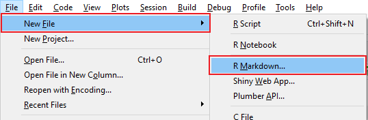
```

```{r new-rmd-template, echo = FALSE, out.width = "60%", fig.cap = "New R Markdown from templates provided by packages"}
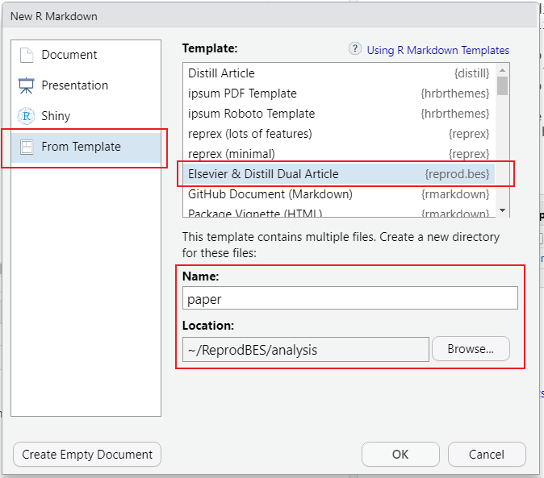
```

Beside using the GUI, you can also run the `rmarkdown::draft()` function:

```{r draft-fake, eval = FALSE}
rmarkdown::draft(file = "analysis/paper", template = "elsevier", package = "reprod.bes")
```

```{r draft, echo = FALSE, eval = FALSE}
withr::with_dir(projpath, {
    if (fs::dir_exists("analysis/paper")) fs::dir_delete("analysis/paper")
    rmarkdown::draft(file = "analysis/paper", template = "elsevier", package = "reprod.bes", edit = FALSE)
})
```

The template R Markdown file called `paper.Rmd` should be automatically opened
for your editing (Fig. \@ref(fig:paper)).

```{r paper, echo = FALSE, fig.cap = "R Markdown template provided by this guide"}
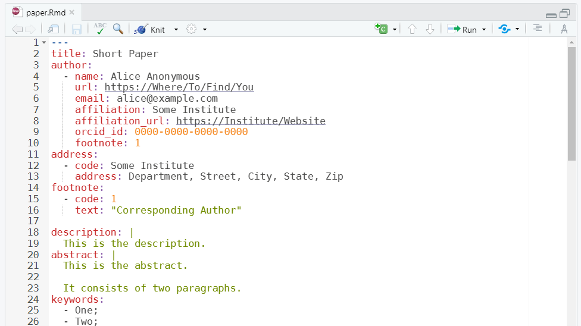
```

`paper.Rmd` skeleton is placed under the `analysis/paper` folder. There are also
other resources that are needed for this template which have been copied to that
folder too (Fig. \@ref(fig:paper-src)).

```{r paper-src, echo = FALSE, out.width = "80%", fig.cap = "Resources needed for the template"}
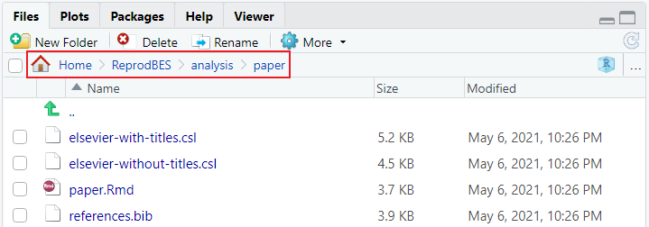
```

## Compile an R Markdown document

The usual way to compile an R Markdown document is to click the `Knit` button as
shown in Fig. \@ref(fig:paper), and the corresponding keyboard shortcut is
`Ctrl + Shift + K` (`Cmd + Shift + K` on macOS). Under the hood, RStudio calls the function
rmarkdown::render() to render the document in a new R session.

By default, the first output format specified in the [YAML frontmatter] will be
rendered. You can choose to render other format by clickiing the little triangle
button.

```{r, echo = FALSE, out.width = "30%", fig.cap = "Knit manu provided by RStudio"}
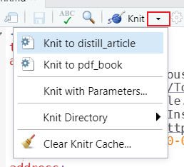
```

After knitting, the output file will automatically be opened for your preview.

Fig. \@ref(fig:prev-distill) gives you the preview of the R Markdown template in
Distill article format, while Fig. \@ref(fig:prev-elsevier) gives you the
Elsevier one.

```{r prev-distill, echo = FALSE, out.width = "80%", fig.cap = "Distill output of the R Markdown template"}
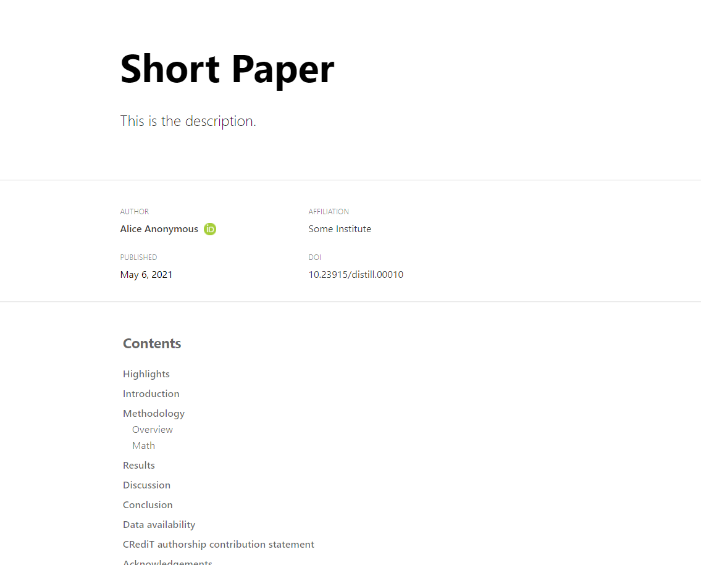
```

```{r prev-elsevier, echo = FALSE, out.width = "80%", fig.cap = "Elsevier PDF output of the R Markdown template"}
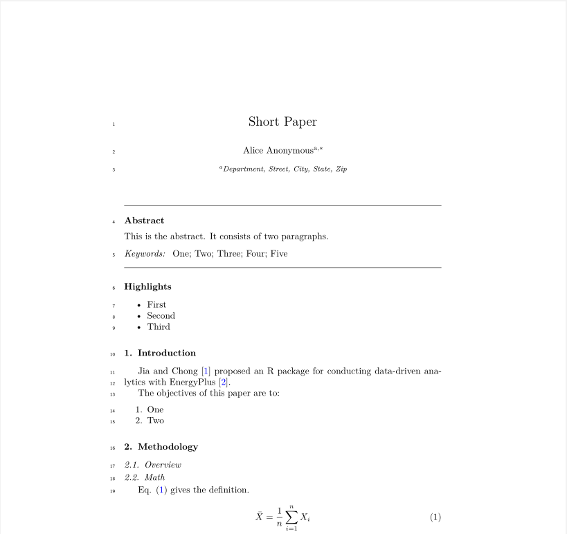
```

## YAML frontmatter

Below is the YAML frontmatter from the template provided by this guide. It is a
mix of YAML frontmatter for Distill and PDF output. Not all of them will take
effect in both formats.

```{.yaml}
---
title: Short Paper
author:
  - name: Alice Anonymous
    url: https://Where/To/Find/You
    email: alice@example.com
    affiliation: Some Institute
    affiliation_url: https://Institute/Website
    orcid_id: 0000-0000-0000-0000
    footnote: 1
address:
  - code: Some Institute
    address: Department, Street, City, State, Zip
footnote:
  - code: 1
    text: "Corresponding Author"

description: |
  This is the description.
  It consists of two paragraphs.
abstract: |
  This is the abstract.
  It consists of two paragraphs.
keywords:
  - One;
  - Two;
  - Three;
  - Four;
  - Five

date: "`r Sys.Date()`"

journal: "An awesome journal"

# Distill output citation data
volume: 10
issue: 4
doi: "10.23915/distill.00010"
slug: anonymous2018
citation_url: https://Your/URL

bibliography: references.bib

# Distill output
# bibliography style
csl: elsevier-with-titles.csl
# whether to add a PDF download link in the dritill output
download: true

# PDF output
linenumbers: true
numbersections: true
colorlinks: true
link-citations: true
biblio-style: unsrtnat
header-includes:
  - \biboptions{sort&compress}
  - \hypersetup{bookmarksnumbered=true}

output:
  # Distill output
  distill::distill_article:
    toc: true
    toc_float: true
    self_contained: false
  # PDF output
  bookdown::pdf_book:
    base_format: rticles::elsevier_article
    keep_tex: true
    citation_package: natbib

# RStudio Visual Editor options
editor_options:
  markdown:
    wrap: 80
---
```

### Author metadata

There are three main fields that define the author metadata, including `author`,
`address` and `footnote`. Each one contains sub-fields.

```{.yaml}
---
author:
  - name: Alice Anonymous
    url: https://Where/To/Find/You
    email: alice@example.com
    affiliation: Some Institute
    affiliation_url: https://Institute/Website
    orcid_id: 0000-0000-0000-0000
    footnote: 1
address:
  - code: Some Institute
    address: Department, Street, City, State, Zip
footnote:
  - code: 1
    text: "Corresponding Author"
---
```

Below seperate the fields in the YAML frontmatter and the corresponding outputs
based on the output formats.

:::: {.columns style="display: flex;"}

::: {.column width="10%"}
**Distill HTML:**
:::

::: {.column width="50%"}
```{.yaml}
---
author:
  - name: Alice Anonymous
    url: https://Where/To/Find/You
    affiliation: Some Institute
    affiliation_url: https://Institute/Website
    orcid_id: 0000-0000-0000-0000
---
```
:::

::: {.column width="45%"}
```{r, echo = FALSE, out.width = "100%"}
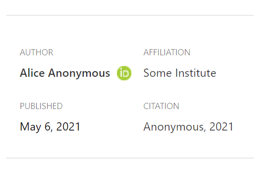
```
:::

::::

:::: {.columns style="display: flex;"}

::: {.column width="10%"}
**Elsevier PDF:**
:::

::: {.column width="50%"}
```{.yaml}
---
author:
  - name: Alice Anonymous
    email: alice@example.com
    affiliation: Some Institute
    footnote: 1
address:
  - code: Some Institute
    address: Department, Street, City, State, Zip
footnote:
  - code: 1
    text: "Corresponding Author"
---
```
:::

::: {.column width="45%"}
```{r, echo = FALSE, out.width = "100%"}
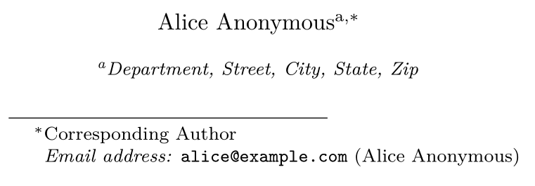
```
:::

::::

### Article metadata

There are five fields that define the article metadata, including `title`,
`description`, `abstract`, `keywords`, `date` and `journal`.

```{.yaml}
---
title: Short Paper
description: |
  This is the description.
abstract: |
  This is the abstract.

  It consists of two paragraphs.
keywords:
  - One;
  - Two;
  - Three;
  - Four;
  - Five
date: "`r Sys.Date()`"
journal: "An awesome journal"
---
```

Below seperate the article meta fields in the YAML frontmatter and the
corresponding outputs based on the output formats.

:::: {.columns style="display: flex;"}

::: {.column width="10%"}
**Distill HTML:**
:::

::: {.column width="50%"}
```{.yaml}
---
title: Short Paper
description: |
  This is the description.
date: "`r Sys.Date()`"
---
```
:::

::: {.column width="45%"}
```{r, echo = FALSE, out.width = "100%"}
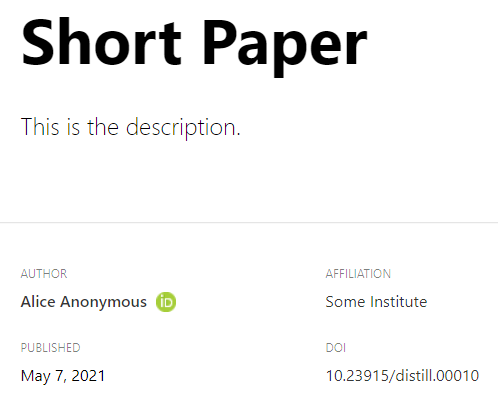
```
:::

::::

:::: {.columns style="display: flex;"}

::: {.column width="10%"}
**Elsevier PDF:**
:::

::: {.column width="50%"}
```{.yaml}
---
title: Short Paper
abstract: |
  This is the abstract.

  It consists of two paragraphs.
keywords:
  - One;
  - Two;
  - Three;
  - Four;
  - Five
date: "`r Sys.Date()`"
journal: "An awesome journal"
---
```
:::

::: {.column width="45%"}
```{r, echo = FALSE, out.width = "100%"}
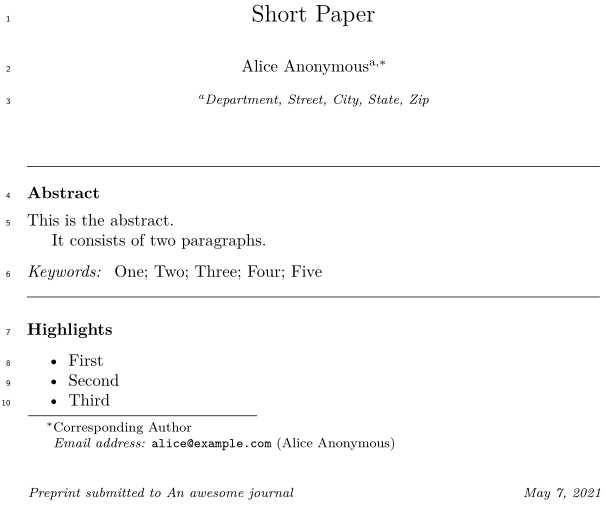
```
:::

::::

### Citation metadata

One nice feature of the Distill output is that it provides tools for making the
articles more easily citeable, as well as for generating Google Scholar
compatible citation metadata.

```{.yaml}
---
journal: "An awesome journal"
volume: 10
issue: 4
doi: "10.23915/distill.00010"
slug: anonymous2018
citation_url: https://Your/URL
---
```

A `Citation` section that contains the BibTeX entry for current article will be
automatically appended at the end. Note that the `citation_url` is included in
the BibTeX entry within the note field.

```{r, echo = FALSE, out.width = "60%"}
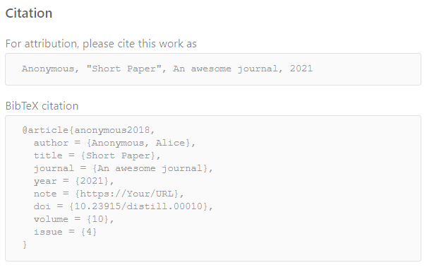
```

Moreover, Distill articles automatically include metadata compatible with the
format indexed by Google Scholar. This makes it easy for indexing engines
(Google Scholar or otherwise) to extract not only a citation for your article
but also information on other sources which you cited.

Below is the HTML meta data that Distill generated:

```{.html}
<!--  https://scholar.google.com/intl/en/scholar/inclusion.html#indexing -->
<meta name="citation_title" content="Short Paper"/>
<meta name="citation_fulltext_html_url" content="https://Your/URL"/>
<meta name="citation_volume" content="10"/>
<meta name="citation_issue" content="4"/>
<meta name="citation_doi" content="10.23915/distill.00010"/>
<meta name="citation_journal_title" content="An awesome journal"/>
<meta name="citation_online_date" content="2021/05/07"/>
<meta name="citation_publication_date" content="2021/05/07"/>
<meta name="citation_author" content="Alice Anonymous"/>
<meta name="citation_author_institution" content="Some Institute"/>
```

For more details on the citation feature that Distill provides, please check out
[Distill's website](https://rstudio.github.io/distill/citations.html)

## Integrate R Markdown with analyses

## Edit R Markdown in Visual Mode

RStudio v1.4 includes a new [visual markdown editing mode](https://rstudio.github.io/visual-markdown-editing/)
which provides a near [WYSIWYM](https://en.wikipedia.org/wiki/WYSIWYM) writing
experience for R Markdown document. You can go through the
[documentation](https://rstudio.github.io/visual-markdown-editing/)
to learn how to use it.
