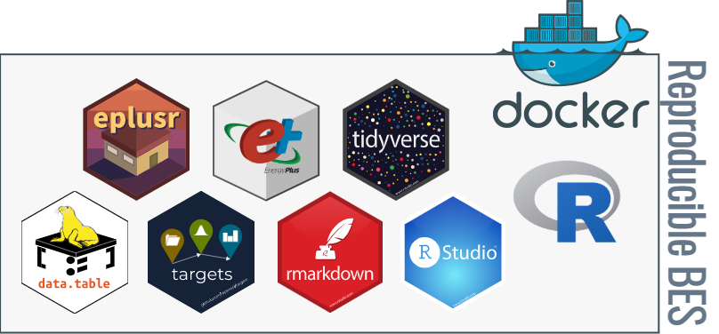

```{r setup, include = FALSE}
options(digits = 3, width = 68, str = strOptions(strict.width = "cut"))

knitr::opts_chunk$set(
    comment = "#>",
    collapse = TRUE,
    fig.align = "center",
    out.width = "100%",
    width = 68
)

if (knitr::is_latex_output()) {
    options(crayon.enabled = FALSE)
    options(cli.unicode = TRUE)
}
```

# Welcome {-}

Welcome to the Reproducing building simulations using R by [Hongyuan Jia](https://hongyuanjia.me).

In this guide you'll learn how to use R-package-style file structure to create a
research compendium for building energy simulations using R.

```{r cover, echo = FALSE}

```

This guide is still work-in-progress. It heavily leans on a collection of
various open-source books, reports, papers and manuals, including but not
exhaustive:

* [rOpenSci](https://ropensci.org/)
  [Reproducibility Guide](https://ropensci.github.io/reproducibility-guide/)
  [@ropensci2018reproducibility]
* [R Packages](https://r-pkgs.org/) book [@wickham2015packages]
* [Reproducible computation at scale in R with {targets}](https://github.com/wlandau/targets-tutorial)
  toturial [@landau2021reproducible]
* {usethis}
  [*Setup*](https://usethis.r-lib.org/articles/articles/usethis-setup.html) and
  [*Managing Git(Hub) Credentials*](https://usethis.r-lib.org/articles/articles/git-credentials.html)
  vignettes [@wickham2021usethis]
* {eplusr}
  [*Parametric simulations*](https://hongyuanjia.github.io/eplusr/articles/param.html)
  vignette [@jia2021eplusr]
* [R Markdown: The Definitive Guide](https://bookdown.org/yihui/rmarkdown/) book
  [@xie2018markdown]
* {renv} [*Introduction to {renv}*](https://rstudio.github.io/renv/articles/renv.html)
  vignette [@ushey2021renv]
* rOpenSci [R Docker tutorial](https://ropenscilabs.github.io/r-docker-tutorial/)
  and RStudio [Docker 101 for Data Scientists](https://environments.rstudio.com/docker.html).

## License {-}

<a rel="license" href="http://creativecommons.org/licenses/by-nc/4.0/">
    
</a>
<br/>
<span xmlns:dct="http://purl.org/dc/terms/" property="dct:title">
    *Reproducing building energy simulations using R*
</span>
    by
<a xmlns:cc="http://creativecommons.org/ns#" href="https://github.com/hongyuanjia/reprod-bes" property="cc:attributionName" rel="cc:attributionURL">
    Hongyuan Jia
</a>
    is licensed under a
<a rel="license" href="http://creativecommons.org/licenses/by-nc/4.0/">
    Creative Commons Attribution-NonCommercial 4.0 International License</a>.
